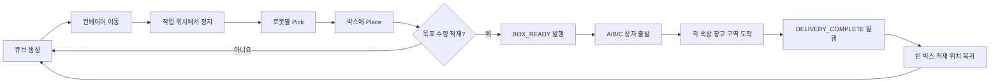

# Industrial Sim Capstone

Gazebo에서 컨베이어로 공급되는 물품을 로봇팔이 박스에 적재하고,
AMR이 A/B/C 박스를 각각 왼쪽·가운데·오른쪽 출하 문까지 운반하는 스마트 팩토리 시뮬레이션 프로젝트입니다.

## MVP 동작

1. 컨베이어 위의 물품 이동
2. 작업 위치에서 물품 정지
3. 로봇팔 Pick & Place
4. 박스 적재 완료 신호 발행
5. 물품이 담긴 A/B/C 이동식 상자의 지정 구역 이동
6. 출하 문 도착 후 빈 박스의 적재 위치 자동 복귀
7. 새 랜덤 배치를 생성해 다음 생산 주기 자동 시작

## 콘셉트 영상

[스마트팩토리 구현 스토리 예시 영상 보기](media/industrial_sim_story_example.mp4)

> 이 영상은 최종 Gazebo 실행 결과가 아니라 프로젝트의 목표 공정과 시연 흐름을
> 설명하기 위한 콘셉트 영상입니다.

## 개발 환경

- Ubuntu 24.04 (WSL2)
- ROS 2 Jazzy
- Gazebo Harmonic
- Python 3

## 패키지 구성

| 패키지 | 역할 |
| --- | --- |
| `factory_description` | 공장 월드, 로봇, 컨베이어 및 AMR 모델 |
| `conveyor_control` | 물품 생성, 컨베이어 이동 및 정지 |
| `arm_control` | 로봇팔 Pick & Place |
| `amr_control` | LiDAR·AMCL 위치 추정, Nav2 경로 계획 및 운송 제어 |
| `item_vision` | RGB-D 영상 기반 물품 분류와 3차원 위치 추정 |
| `factory_manager` | 전체 공정 상태 머신 및 통합 실행 |

## 구현 흐름



| 단계 | 담당 패키지 | 입력 | 동작 | 출력 |
| --- | --- | --- | --- | --- |
| 1. 물품 공급 | `conveyor_control` | `/conveyor/start` | 큐브를 작업 위치까지 이동 | `/item/ready` |
| 2. Pick & Place | `arm_control` | `/arm/start_pick` | 큐브를 집어 박스에 적재 | `/arm/task_complete` |
| 3. 적재 확인 | `factory_manager` | `/box/item_count` | 목표 적재 수량 확인 | `/box/ready` |
| 4. AMR 운송 | `amr_control` | `/amr/start_delivery` | 박스를 창고 구역으로 운송 | `/amr/delivery_complete` |
| 5. 공정 완료 | `factory_manager` | 배송 완료 신호 | 전체 상태를 `DELIVERED`로 변경 | `/factory/state` |
| 6. 반복 준비 | `amr_control` | 배송 완료 | C/B/A 순서로 충돌 없이 복귀 | `/amr/return_complete` |
| 7. 다음 주기 | `conveyor_control` | 복귀 완료 | 시드를 변경해 새 배치 생성 | `/item_spawner/ready` |

## 폴더 구조

```text
industrial-sim-capstone/
├── README.md
├── LICENSE
├── media/
│   └── industrial_sim_story_example.mp4
├── docs/
│   ├── architecture.md
│   ├── requirements.md
│   └── team-tasks.md
└── src/
    ├── factory_description/
    │   ├── launch/
    │   ├── models/
    │   ├── urdf/
    │   └── worlds/
    ├── conveyor_control/
    │   ├── launch/
    │   └── scripts/
    ├── arm_control/
    │   ├── launch/
    │   └── scripts/
    ├── amr_control/
    │   ├── config/
    │   ├── launch/
    │   └── scripts/
    └── factory_manager/
        ├── config/
        ├── launch/
        └── scripts/
```

## 현재 구현 상태

- ROS 2 패키지 골격과 기본 문서
- Gazebo Harmonic에서 여는 자체 포함 분류 작업 셀
- 물리 기반 컨베이어 구동과 픽업 위치 자동 정지
- 관절 피드백 기반 SCARA 팔과 흡착식 Pick & Place
- OpenCV RGB-D 색상·형상 분류와 3차원 위치 추정
- 3종 샘플 물품·RGB-D 센서·A/B/C 상자
- 시드 기반 A/B/C 물품 도착 순서·간격 랜덤 배치와 작업 ID 발행
- 3개 물품 적재 완료 집계와 전체 공정 상태 머신
- Nav2 전역 계획·경로 추종 기반 A/B/C 이동식 상자의 출하 문 운송
- 각 이동 상자의 360도 LiDAR와 휠 오도메트리, AMCL 기반 위치 추정
- `/scan` 장애물 레이어와 충돌 예측을 이용한 정적·동적 장애물 대응
- 시간 초과·무진행·목표 오차 감지와 최대 2회 자동 재시도
- 대형 창고 외벽, 고천장 조명, 팔레트 랙, 적재 도크와 통로 마킹
- ROS 2 상태를 실시간 표시하는 브라우저 공정 관제 대시보드
- 배송·복귀·재공급으로 이어지는 무한 반복 생산 사이클

각 생산 주기는 A/B/C 물품 한 개씩으로 구성됩니다. 한 배치가 끝나면
빨강·초록·파랑 박스가 각각 왼쪽·가운데·오른쪽 파란 출하 문으로 이동하고,
도착 후 적재 위치로 복귀합니다. 이어서 다음 시드의 물품 순서를 생성하고
분류 공정을 자동으로 다시 시작합니다.

창고 레이아웃은 Apache-2.0으로 공개된
[Gazebo Jetty 데모](https://github.com/gazebosim/jetty_demo)의 구성을 참고해
ROS 2 Jazzy와 Gazebo Harmonic에서 가볍게 실행되는 기본 도형 기반 월드로
재구성했습니다.

## 빌드 및 테스트 월드 실행

ROS 2 Jazzy와 Gazebo Harmonic 및 `ros_gz`가 설치된 Ubuntu 24.04에서
다음 명령을 실행합니다.

```bash
source /opt/ros/jazzy/setup.bash
./scripts/setup-dev.sh
source install/setup.bash
ros2 launch factory_description factory_test.launch.py
```

다른 랜덤 배치를 재현하려면 시드를 지정합니다. 같은 시드는 같은 도착 순서와
간격을 만듭니다.

```bash
ros2 launch factory_description factory_test.launch.py random_seed:=17
```

현재 배치의 시드, 도착 순서, 물품별 작업 ID는
`/item_spawner/manifest` 토픽에 JSON으로 발행됩니다.
전체 진행 상태는 `/factory/state`에서 확인할 수 있으며, 정상 완료 시
`DELIVERED`가 발행됩니다.
활성 상자의 센서는 `/scan`과 `/nav/odom`으로 전달되고, AMCL 추정 위치는
`/amcl_pose`와 `map → odom → base_link` TF에서 확인할 수 있습니다.
통합 launch를 실행하면 `http://127.0.0.1:8080`의 관제 대시보드가 자동으로
열립니다. 처리량, 비전 신뢰도, 클래스별 수량과 각 상자의 배송 상태를
실시간으로 확인할 수 있습니다.

테스트는 다음 명령으로 실행합니다.

```bash
colcon test
colcon test-result --verbose
```

## 협업 방법

1. 담당 기능의 브랜치를 생성합니다.
2. 기능을 구현하고 로컬 실행을 확인합니다.
3. Pull Request를 생성합니다.
4. 팀원 한 명 이상의 검토 후 `main`에 병합합니다.

브랜치 이름 예시:

```text
feature/world
feature/conveyor
feature/arm
feature/amr
feature/factory-manager
```

## 문서

- [요구사항](docs/requirements.md)
- [시스템 구조와 인터페이스](docs/architecture.md)
- [팀 작업 분담](docs/team-tasks.md)
