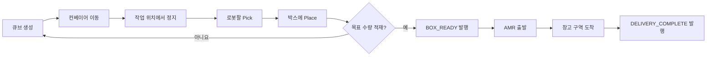

# Industrial Sim Capstone

Gazebo에서 컨베이어로 공급되는 물품을 로봇팔이 박스에 적재하고,
AMR이 박스를 창고 구역까지 운반하는 스마트 팩토리 시뮬레이션 프로젝트입니다.

## MVP 동작

1. 컨베이어 위의 물품 이동
2. 작업 위치에서 물품 정지
3. 로봇팔 Pick & Place
4. 박스 적재 완료 신호 발행
5. AMR의 창고 구역 이동
6. 전체 공정 완료 상태 출력

## 콘셉트 영상

[스마트팩토리 구현 스토리 예시 영상 보기](media/industrial_sim_story_example.mp4)

> 이 영상은 최종 Gazebo 실행 결과가 아니라 프로젝트의 목표 공정과 시연 흐름을
> 설명하기 위한 콘셉트 영상입니다.

## 개발 환경

- Ubuntu 24.04 (WSL2)
- ROS 2 Jazzy
- Gazebo Harmonic
- Python 3

## 패키지 구성

| 패키지 | 역할 |
| --- | --- |
| `factory_description` | 공장 월드, 로봇, 컨베이어 및 AMR 모델 |
| `conveyor_control` | 물품 생성, 컨베이어 이동 및 정지 |
| `arm_control` | 로봇팔 Pick & Place |
| `amr_control` | AMR 운송 경로 제어 |
| `factory_manager` | 전체 공정 상태 머신 및 통합 실행 |

## 구현 흐름



| 단계 | 담당 패키지 | 입력 | 동작 | 출력 |
| --- | --- | --- | --- | --- |
| 1. 물품 공급 | `conveyor_control` | `/conveyor/start` | 큐브를 작업 위치까지 이동 | `/item/ready` |
| 2. Pick & Place | `arm_control` | `/arm/start_pick` | 큐브를 집어 박스에 적재 | `/arm/task_complete` |
| 3. 적재 확인 | `factory_manager` | `/box/item_count` | 목표 적재 수량 확인 | `/box/ready` |
| 4. AMR 운송 | `amr_control` | `/amr/start_delivery` | 박스를 창고 구역으로 운송 | `/amr/delivery_complete` |
| 5. 공정 완료 | `factory_manager` | 배송 완료 신호 | 전체 상태를 `DELIVERED`로 변경 | `/factory/state` |

## 폴더 구조

```text
industrial-sim-capstone/
├── README.md
├── LICENSE
├── media/
│   └── industrial_sim_story_example.mp4
├── docs/
│   ├── architecture.md
│   ├── requirements.md
│   └── team-tasks.md
└── src/
    ├── factory_description/
    │   ├── launch/
    │   ├── models/
    │   ├── urdf/
    │   └── worlds/
    ├── conveyor_control/
    │   ├── launch/
    │   └── scripts/
    ├── arm_control/
    │   ├── launch/
    │   └── scripts/
    ├── amr_control/
    │   ├── config/
    │   ├── launch/
    │   └── scripts/
    └── factory_manager/
        ├── config/
        ├── launch/
        └── scripts/
```

## 실행 방법

패키지 구현 및 통합 후 다음 형식으로 실행 명령을 제공합니다.

```bash
colcon build --symlink-install
source install/setup.bash
ros2 launch factory_manager factory_demo.launch.py
```

## 협업 방법

1. 담당 기능의 브랜치를 생성합니다.
2. 기능을 구현하고 로컬 실행을 확인합니다.
3. Pull Request를 생성합니다.
4. 팀원 한 명 이상의 검토 후 `main`에 병합합니다.

브랜치 이름 예시:

```text
feature/world
feature/conveyor
feature/arm
feature/amr
feature/factory-manager
```

## 문서

- [요구사항](docs/requirements.md)
- [시스템 구조와 인터페이스](docs/architecture.md)
- [팀 작업 분담](docs/team-tasks.md)
